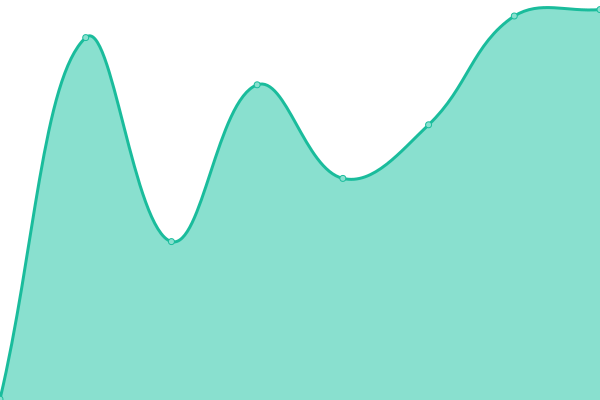
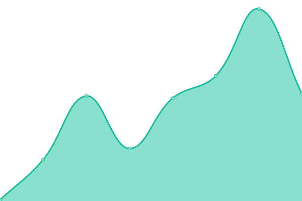
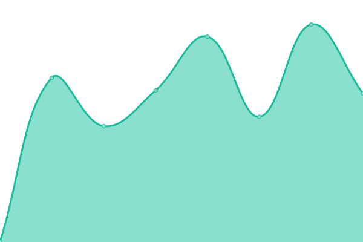
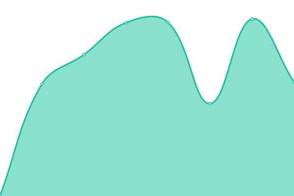
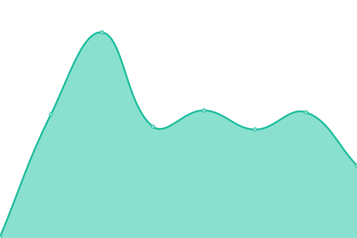
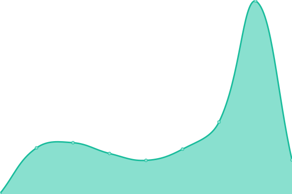

# [📈 Live Status](https://captv.ovh): <!--live status--> **🟧 Partial outage**

This repository contains the open-source uptime monitor and status page for [Vishnu Ravendranthan](https://captv.ovh), powered by [Upptime](https://github.com/upptime/upptime).

With [Upptime](https://upptime.js.org), you can get your own unlimited and free uptime monitor and status page, powered entirely by a GitHub repository. We use [Issues](https://github.com/captv89/uptime-monitor/issues) as incident reports, [Actions](https://github.com/captv89/uptime-monitor/actions) as uptime monitors, and [Pages](https://captv.ovh) for the status page.

<!--start: status pages-->
<!-- This summary is generated by Upptime (https://github.com/upptime/upptime) -->
<!-- Do not edit this manually, your changes will be overwritten -->
<!-- prettier-ignore -->
| URL | Status | History | Response Time | Uptime |
| --- | ------ | ------- | ------------- | ------ |
|  [Portfolio](https://captv.ovh/) | 🟥 Down | [portfolio.yml](https://github.com/captv89/uptime-monitor/commits/HEAD/history/portfolio.yml) | 

 0ms
     
 | 

<a href="https://captv89.github.io/uptime-monitor/history/portfolio">0.00%</a>
    

|  [Photography](https://captv89.github.io/photography/) | 🟥 Down | [photography.yml](https://github.com/captv89/uptime-monitor/commits/HEAD/history/photography.yml) | 

 0ms
     
 | 

<a href="https://captv89.github.io/uptime-monitor/history/photography">0.00%</a>
    

|  [Searoute](https://searoute.captv.ovh) | 🟥 Down | [searoute.yml](https://github.com/captv89/uptime-monitor/commits/HEAD/history/searoute.yml) | 

 729ms
     
 | 

<a href="https://captv89.github.io/uptime-monitor/history/searoute">46.96%</a>
    

|  [CII](https://cii.captv.ovh/) | 🟥 Down | [cii.yml](https://github.com/captv89/uptime-monitor/commits/HEAD/history/cii.yml) | 

 740ms
     
 | 

<a href="https://captv89.github.io/uptime-monitor/history/cii">46.96%</a>
    

|  [Svelte GeoMap](https://svelte-map-theta.vercel.app/) | 🟩 Up | [svelte-geo-map.yml](https://github.com/captv89/uptime-monitor/commits/HEAD/history/svelte-geo-map.yml) | 

 122ms
     
 | 

<a href="https://captv89.github.io/uptime-monitor/history/svelte-geo-map">100.00%</a>
    

|  [Calculator](https://svelte-calculator-alpha.vercel.app/) | 🟩 Up | [calculator.yml](https://github.com/captv89/uptime-monitor/commits/HEAD/history/calculator.yml) | 

 112ms
     
 | 

<a href="https://captv89.github.io/uptime-monitor/history/calculator">100.00%</a>
    

<!--end: status pages-->

[**Visit our status website →**](https://captv.ovh)

## 📄 License

- Powered by: [Upptime](https://github.com/upptime/upptime)
- Code: [MIT](./LICENSE) © [Vishnu Ravendranthan](https://captv.ovh)
- Data in the `./history` directory: [Open Database License](https://opendatacommons.org/licenses/odbl/1-0/)
